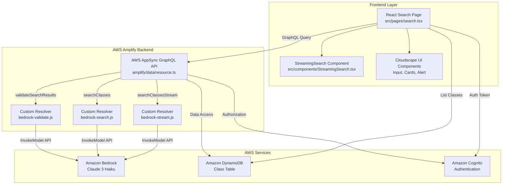
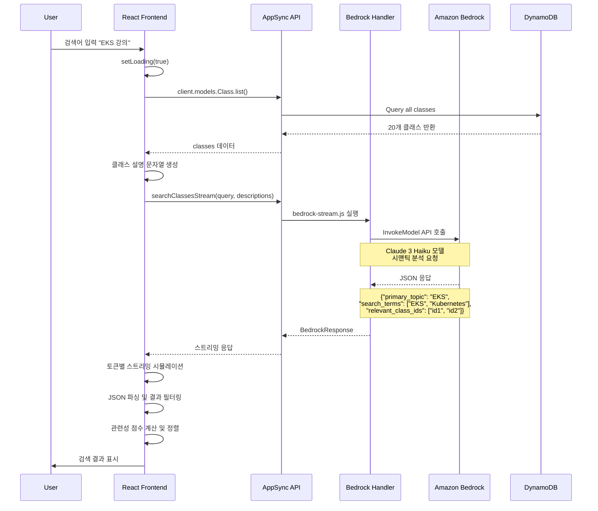
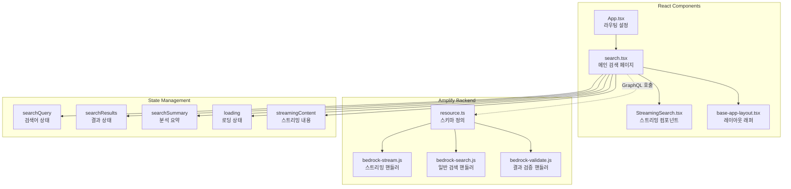
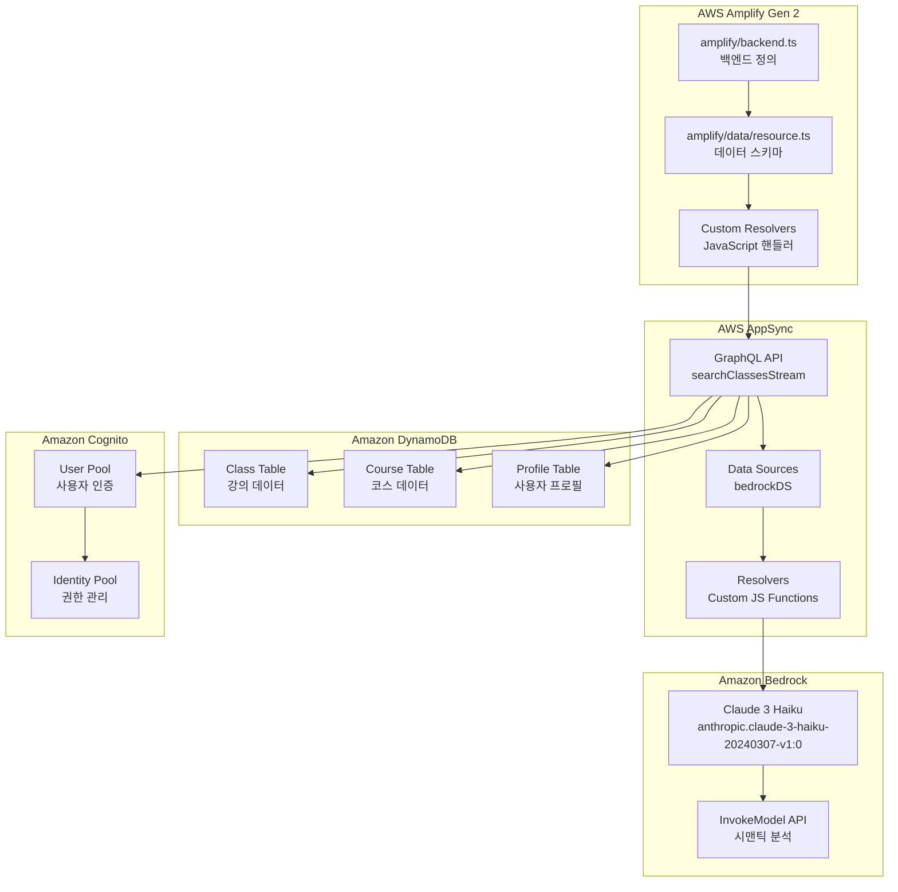

# AWS Amplify Bedrock Search 아키텍처

## 전체 시스템 아키텍처



## 검색 플로우 상세 다이어그램



## 데이터 플로우 아키텍처

```mermaid
flowchart LR
    subgraph "Input Processing"
        A1[사용자 검색어<br/>"EKS 강의"]
        A2[DynamoDB 클래스 로드<br/>20개 클래스]
        A3[클래스 설명 결합<br/>단일 문자열]
    end
    
    subgraph "Bedrock Processing"
        B1[Bedrock 프롬프트 생성<br/>검색어 + 클래스 설명]
        B2[Claude 3 Haiku 호출<br/>시맨틱 분석]
        B3[JSON 응답 파싱<br/>관련 클래스 ID 추출]
    end
    
    subgraph "Result Processing"
        C1[시맨틱 매칭<br/>relevant_class_ids 사용]
        C2[폴백 텍스트 매칭<br/>검색어 포함 여부]
        C3[관련성 점수 계산<br/>제목 > 설명 > 내용]
        C4[결과 정렬 및 표시<br/>Cards UI 컴포넌트]
    end
    
    A1 --> B1
    A2 --> A3
    A3 --> B1
    B1 --> B2
    B2 --> B3
    B3 --> C1
    C1 -->|결과 없음| C2
    C1 -->|결과 있음| C3
    C2 --> C3
    C3 --> C4
```

## 컴포넌트 구조 다이어그램



## AWS 서비스 연동 다이어그램



이 아키텍처는 AWS Amplify Gen 2의 최신 패턴을 사용하여 Bedrock과 완전히 통합된 지능형 검색 시스템을 구현합니다.
